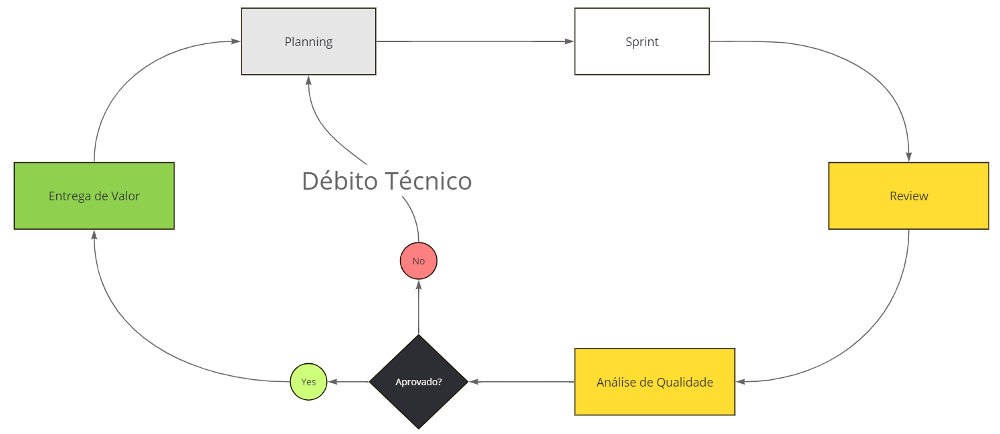
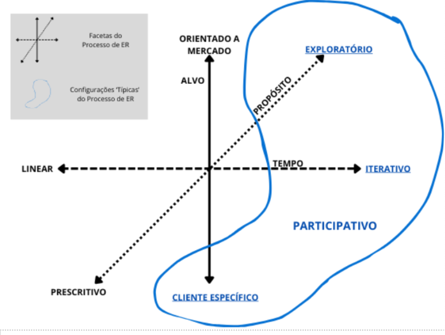

## Processo de desenvolvimento de ER

### Metodologia
| Metodologia | Ciclo de Vida | Processo | FrameWork |
| ----------- | ------------- | -------- | --------- |
| Ágil        | Ágil          | XP       | Scrum |

### Fluxo de Trabalho

### Processo de ER

### Atividades
| Atividade                 | Método                                    | Ferramenta     | Entrega                      |
| ------------------------- | ----------------------------------------- | -------------- | ---------------------------- |
| Elicitação e Descoberta   | Barinstorm, Reunião com o Cliente         | Discord e Miro | Lista de Requisitos          |
| Análise e Consenso        | USM, BrainStorm, Reunião com o Cliente    | Jira           | Users Stories                |
| Declaração                | Planning, Reunião com o Cliente           | Jira e Meet    | Temas, Épicos e Tasks        |
| Representação             | Prototipagem                              | Figma          | Protótipo de Alta Fidelidade |
| Verificação e Validação   | DoR e DoD, Checklist, Reunião com Cliente | Jira e Meet    | Definição de DoR e DoD       |
| Organização e Atualização | USM                                       | Jira           | Backlog |