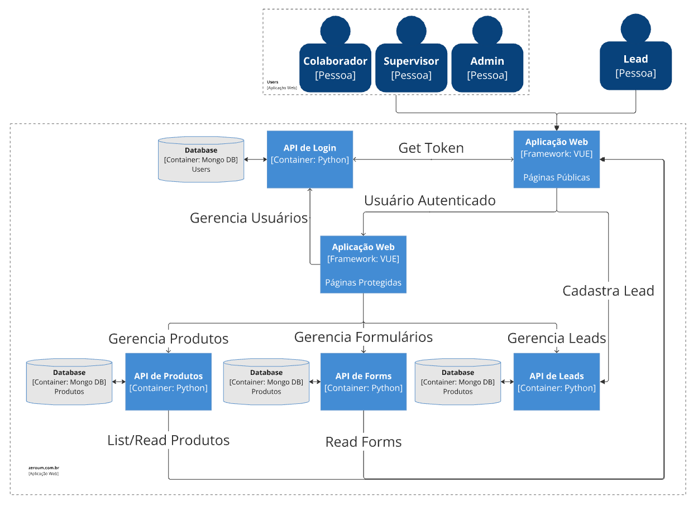

# Arquitetura 

## 1. Modelo
Foi escolhida a arquitetura de microsserviços para tornar o produto mais escalável, facilitando a organização e implementação de novas funcionalidades, além de proporcionar acesso rápido à manutenção. Os componentes modulados dessa arquitetura permitem ao produto adaptar-se à composição de acordo com o cliente. 

## 2. Diagrama de Arquitetura

## 3. Histórico de Versão 
| Data       | Versão | Descrição                      | Autor(es)                                                                                                                                                                       |
| :--------- | :----: | :----------------------------- | :------------------------------------------------------------------------------------------------------------------------------------------------------------------------------ |
| 05/08/2024 | `0.1`  | Criação do histórico de versão |  [Lucas Antunes](https://github.com/LucasGSAntunes) |
