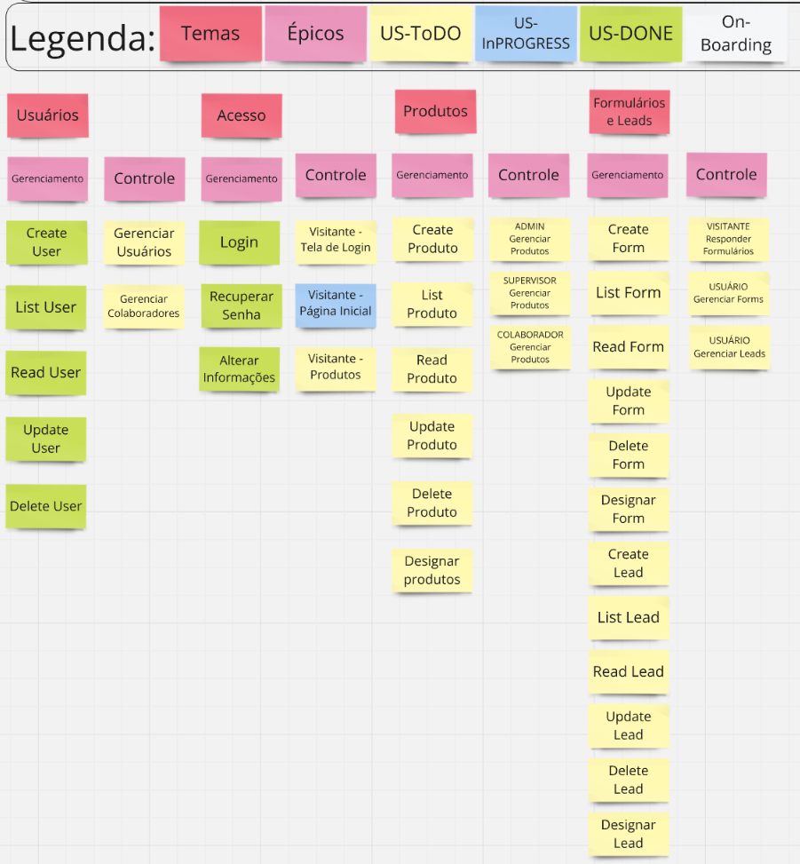

## User Story Mapping

## MVP

| Épico                                 | Capacidade                                   | Feature                                                            | Requisitos Abrangidos | Users Stories                                                                                                                                      | Critérios de Aceitação                                                                                                                                                                                                                                                                                                                                                                           |
| :------------------------------------ | -------------------------------------------- | ------------------------------------------------------------------ | --------------------- | -------------------------------------------------------------------------------------------------------------------------------------------------- | ------------------------------------------------------------------------------------------------------------------------------------------------------------------------------------------------------------------------------------------------------------------------------------------------------------------------------------------------------------------------------------------------ |
| EP-01 - Gestão de usuários            | CA-01 - Gerenciamento de usuários            | FE-01-BACK-Implementar usuário                                     | **RF01**              | US-01 - Como Usuário, eu gostaria de cadastrar um novo usuário para que outras pessoas da equipe possam ter credenciais de acesso                  | 1. O sistema deve permitir o cadastro de um novo usuário com informações básicas.   2. O usuário deve receber uma confirmação de que o cadastro foi realizado com sucesso.   3. O sistema deve validar a integridade dos dados inseridos.   4. O novo usuário deve aparecer na lista de usuários imediatamente após o cadastro.                                                         |
|                                       |                                              |                                                                    |                       | US-02 - Como Usuário, eu gostaria de editar um usuário já cadastrado para atualizar informações                                                    | 1. O sistema deve permitir a edição dos dados de um usuário existente.   2. O usuário deve receber uma confirmação de que as informações foram atualizadas.   3. O sistema deve validar as novas informações fornecidas.   4. O sistema deve guardar o histórico de edições com editor e data.                                                                                          |
|                                       |                                              |                                                                    |                       | US-03 - Como Usuário, eu gostaria de listar os usuários cadastrados para ter acesso facilitado                                                     | 1. O sistema deve exibir uma lista completa dos usuários cadastrados.   2. A lista deve incluir informações básicas como nome e e-mail.   3. O usuário deve ser capaz de buscar e filtrar a lista por critérios específicos.   4. A lista deve ser atualizada em tempo real quando novos usuários forem adicionados ou informações alteradas.                                           |
|                                       |                                              |                                                                    |                       | US-04 - Como Usuário, eu gostaria de deletar um usuário cadastrado para retirar eventuais duplicações                                              | 1. O sistema deve permitir a exclusão de usuários cadastrados.   2. O usuário deve ser notificado e solicitado a confirmar a ação antes da exclusão.   3. Após a exclusão, o usuário deve receber uma confirmação de que o usuário foi removido.   4. O usuário excluído não deve mais aparecer na lista de usuários.                                                                   |
|                                       |                                              | FE-02-BACK-Identificar o tipo de usuário ao utilizar o sistema     | **RF08**              | US-05 - Como Administrador, eu gostaria de ter acesso global para gerenciar e controlar o sistema                                                  | 1. O sistema deve conceder acesso global ao administrador.   2. O administrador deve ser capaz de gerenciar e controlar todas as áreas do sistema.   3. O sistema deve registrar e auditar todas as ações realizadas pelo administrador.   4. O acesso do administrador deve ser restrito e seguro para evitar acessos não autorizados.                                                 |
|                                       |                                              |                                                                    |                       | US-06 - Como Supervisor, eu gostaria de ter acesso à área de supervisor para exercer minhas funções                                                | 1. O sistema deve conceder acesso à área de supervisor para o usuário com essa função.   2. O supervisor deve ser capaz de gerenciar e controlar áreas específicas de acordo com sua função.   3. O sistema deve registrar as ações realizadas pelo supervisor.   4. O acesso do supervisor deve ser restrito às suas permissões.                                                       |
|                                       |                                              |                                                                    |                       | US-07 - Como Colaborador, eu gostaria de ter acesso à área de colaborador para exercer minhas funções                                              | 1. O sistema deve conceder acesso à área de colaborador para o usuário com essa função.   2. O colaborador deve ter acesso apenas às funções e informações necessárias para suas tarefas.   3. O sistema deve registrar as ações realizadas pelo colaborador.   4. O acesso do colaborador deve ser restrito às suas permissões.                                                        |
|                                       | CA-02 - Controle de usuários                 | FE-03-FRONT-**ADMINISTRADOR** - Gerenciar usuários                 | **RF17**              | US-08 - Como Administrador, eu gostaria de criar qualquer tipo de usuário para designar funções da equipe                                          | 1. O administrador deve poder criar novos usuários com qualquer tipo de permissão.   2. O sistema deve permitir a definição de funções e permissões para os novos usuários.   3. O administrador deve receber uma confirmação de que o novo usuário foi criado com sucesso.   4. O novo usuário deve aparecer na lista de usuários imediatamente após a criação.                        |
|                                       |                                              |                                                                    |                       | US-09 - Como Administrador, eu gostaria de designar responsáveis para colaboradores afim de demandar atividades                                    | 1. O administrador deve poder designar responsáveis para colaboradores.   2. O sistema deve permitir a atribuição de responsabilidades e tarefas para os colaboradores designados.   3. O administrador deve receber uma confirmação de que a designação foi realizada com sucesso.   4. Os colaboradores designados devem ser notificados sobre suas novas responsabilidades.          |
|                                       |                                              | FE-04-FRONT-**SUPERVISOR** - Gerenciar colaboradores               | **RF19**              | US-10 - Como Supervisor, eu gostaria de criar colaboradores para que outras pessoas da equipe possam ter credenciais de acesso                     | 1. O supervisor deve poder criar novos colaboradores.   2. O sistema deve permitir a definição de funções e permissões para os novos colaboradores.   3. O supervisor deve receber uma confirmação de que o novo colaborador foi criado com sucesso.   4. O novo colaborador deve aparecer na lista de colaboradores imediatamente após a criação.                                      |
| EP-02 - Gestão de Acesso              | CA-03 - Gerenciamento de acesso              | FE-05-BACK-Segmentar conteúdo mostrado por Usuário e Visitante     | **RF09**              | US-11 - Como Usuário, eu gostaria de ter verificação de credenciais para que somente pessoas autorizadas realizem funções sensíveis                | 1. O sistema deve verificar as credenciais do usuário para funções sensíveis.   2. O acesso deve ser concedido somente a usuários autorizados.   3. O sistema deve exibir uma mensagem de erro em caso de credenciais inválidas.   4. O sistema deve registrar tentativas de acesso não autorizadas.                                                                                    |
|                                       |                                              | FE-06-FRONT-**VISITANTE** - Página inicial                         | **RF10**              | US-12 - Como Visitante, eu gostaria de ter acesso a uma página inicial para que eu possa acessar as principais informações da empresa              | 1. O sistema deve exibir uma página inicial acessível para visitantes.   2. A página inicial deve fornecer informações principais sobre a empresa.   3. A página inicial deve ser acessível sem necessidade de login.   4. O conteúdo da página inicial deve ser atualizado regularmente para refletir as informações mais recentes da empresa.                                         |
|                                       |                                              |                                                                    |                       | US-13 - Como Visitante, eu gostaria de poder me cadastrar como lead para que eu possa enviar informações de contato para a empresa                 | 1. O sistema deve permitir que visitantes se cadastrem como leads.   2. O visitante deve fornecer informações de contato para a empresa.   3. O visitante deve receber uma confirmação de que o cadastro foi realizado com sucesso.   4. As informações do lead devem ser registradas no sistema para futuros contatos.                                                                 |
|                                       |                                              | FE-07-FRONT-**VISITANTE** - Produtos                               | **RF11**              | US-14 - Como Visitante, eu gostaria de ter acesso ao portfólio de produtos para que eu possa avaliar as opções                                     | 1. O sistema deve exibir o portfólio de produtos acessível para visitantes.   2. O visitante deve poder visualizar informações detalhadas sobre cada produto.   3. O portfólio deve ser atualizado regularmente com novos produtos e informações.   4. O visitante deve ter a opção de solicitar mais informações sobre os produtos.                                                    |
|                                       |                                              | FE-08-FRONT-**VISITANTE** - Tela de login                          | **RF13**              | US-15 - Como Visitante, eu gostaria de ter acesso à tela de login para que eu possa me autenticar no sistema                                       | 1. O sistema deve fornecer uma tela de login acessível para visitantes.   2. A tela de login deve permitir que o visitante insira suas credenciais para autenticação.   3. O sistema deve validar as credenciais e fornecer acesso se forem corretas.   4. O sistema deve exibir uma mensagem de erro em caso de credenciais inválidas.                                                 |
|                                       | CA-04 - Controle de acesso                   | FE-09-BACK-Login                                                   | **RF14**              | US-16 - Como Visitante, eu gostaria de validar minhas credenciais para ter acesso à área protegida do sistema                                      | 1. O sistema deve validar as credenciais fornecidas pelo visitante durante o login.   2. O sistema deve conceder acesso à área protegida se as credenciais forem válidas.   3. O visitante deve receber uma mensagem de sucesso ou erro após a tentativa de login.   4. O sistema deve retornar uma token JWT, expirável em 30 minutos, com as informações da sessão em caso de sucesso |
|                                       |                                              | FE-10-BACK/FRONT-Recuperação de credenciais                        | **RF15**              | US-17 - Como Usuário, eu gostaria de recuperar minhas credenciais para acessar novamente o sistema                                                 | 1. O sistema deve fornecer uma opção de recuperação de senha na tela de login.   2. O usuário deve receber um e-mail com instruções para recuperar a senha.   3. O sistema deve permitir que o usuário crie uma nova senha.   4. O usuário deve receber uma confirmação de que a senha foi alterada com sucesso.                                                                        |
|                                       |                                              | FE-11-FRONT-Alteração de informações pessoais                      | **RF16**              | US-18 - Como Usuário, eu gostaria de alterar meus dados para atualizar informações antigas                                                         | 1. O sistema deve permitir que o usuário edite suas informações pessoais a partir de um perfil.   2. O sistema deve validar as novas informações fornecidas.   3. O usuário deve receber uma confirmação de que as informações foram atualizadas.   4. O sistema deve guardar o histórico de edições com editor e data.                                                                 |
| EP-03 - Gestão de produtos            | CA-05 - Gerenciamento de produto             | FE-12-BACK-Implementar tipo produto                                | **RF02**              | US-19 - Como Usuário, eu gostaria de cadastrar um produto para apresentar aos visitantes                                                           | 1. O sistema deve permitir o cadastro de novos produtos com informações básicas como nome, descrição e preço.   2. O usuário deve receber uma confirmação de que o produto foi cadastrado com sucesso.   3. O sistema deve validar se o produto já está cadastrado.   4. O novo produto deve estar disponível na lista de produtos imediatamente após o cadastro.                       |
|                                       |                                              |                                                                    |                       | US-20 - Como Usuário, eu gostaria de editar um produto já cadastrado para atualizar informações                                                    | 1. O sistema deve permitir a edição das informações de um produto existente.   2. O usuário deve receber uma confirmação de que as informações foram atualizadas.   3. O sistema deve validar que o nome do produto não está em uso por outro produto.   4. O sistema deve guardar o histórico de edições com editor e data.                                                            |
|                                       |                                              |                                                                    |                       | US-21 - Como Usuário, eu gostaria de listar os produtos cadastrados para ter acesso facilitado                                                     | 1. O sistema deve permitir a visualização de uma lista completa dos produtos cadastrados.   2. A lista deve exibir informações básicas dos produtos como nome e preço.   3. O usuário deve ser capaz de buscar e filtrar a lista por nome ou categoria.   4. A lista deve ser atualizada em tempo real quando novos produtos forem adicionados ou informações alteradas.                |
|                                       |                                              |                                                                    |                       | US-22 - Como Usuário, eu gostaria de deletar um produto cadastrado para retirar eventuais duplicações                                              | 1. O sistema deve permitir a exclusão de produtos cadastrados.   2. O usuário deve ser notificado e solicitado a confirmar a ação antes da exclusão.   3. Após a exclusão, o usuário deve receber uma confirmação de que o produto foi removido.   4. O produto deletado não deve mais aparecer na lista de produtos.                                                                   |
|                                       |                                              | FE-13-BACK-Identificar a qual usuário pertence determinado produto | **RF07**              | US-23 - Como Administrador, eu gostaria de designar responsáveis para produtos afim de demandar atividades                                         | 1. O administrador deve poder designar responsáveis para cada produto.   2. O sistema deve permitir a atribuição de atividades específicas para cada produto.   3. O administrador deve receber confirmações de designação de atividades.   4. Os responsáveis devem ser notificados sobre as atividades designadas.                                                                    |
|                                       |                                              |                                                                    |                       | US-24 - Como Supervisor, eu gostaria de designar responsáveis para produtos afim de demandar atividades para minha equipe                          | 1. O supervisor deve poder designar responsáveis para produtos em sua equipe.   2. O sistema deve permitir a atribuição de atividades para os produtos designados.   3. O supervisor deve receber confirmações de designação de responsabilidades.   4. Os responsáveis devem ser notificados sobre suas novas responsabilidades.                                                       |
|                                       | CA-06 - Controle de Produto                  | FE-14-FRONT-**ADMINISTRADOR** - Gerenciar produtos                 | **RF18**              | US-25 - Como Administrador, eu gostaria de ter acesso à área de produtos para gerenciar produtos cadastrados                                       | 1. O administrador deve ter acesso a uma área de gerenciamento de produtos.   2. O administrador deve poder visualizar, adicionar, editar e excluir produtos.   3. O sistema deve exibir uma lista completa dos produtos gerenciados pelo administrador.   4. O sistema deve guardar o histórico de edições com editor e data.                                                          |
|                                       |                                              | FE-15-FRONT-**SUPERVISOR** - Gerenciar produtos                    | **RF20**              | US-26 - Como Supervisor, eu gostaria de ter acesso à área de produtos para gerenciar meus produtos cadastrados                                     | 1. O supervisor deve ter acesso à área de gerenciamento de produtos.   2. O supervisor deve poder visualizar, adicionar, editar e excluir produtos em sua equipe.   3. O sistema deve exibir uma lista completa dos produtos gerenciados pelo supervisor.   4. O sistema deve guardar o histórico de edições com editor e data.                                                         |
|                                       |                                              | FE-16-FRONT-**COLABORADOR** - Gerenciar produtos                   | **RF21**              | US-27 - Como Colaborador, eu gostaria de ter acesso à área de produtos para gerenciar meus produtos cadastrados                                    | 1. O colaborador deve ter acesso à área de gerenciamento de produtos.   2. O colaborador deve poder visualizar, adicionar, editar e excluir produtos em sua responsabilidade.   3. O sistema deve exibir uma lista completa dos produtos gerenciados pelo colaborador.   4. O sistema deve guardar o histórico de edições com editor e data.                                            |
| EP-04 - Gestão de formulários e leads | CA-07 - Gerenciamento de Formulários e Leads | FE-17-BACK-Implementar tipo formulário                             | **RF03**              | US-28 - Como Usuário, eu gostaria de cadastrar um formulário, em um produto, para segmentar os leads nele cadastrados                              | 1. O sistema deve permitir o cadastro de novos formulários para produtos.   2. O usuário deve receber uma confirmação de que o formulário foi cadastrado com sucesso.   3. O sistema deve validar os dados do formulário.   4. O novo formulário deve estar disponível na lista de formulários imediatamente após o cadastro.                                                           |
|                                       |                                              |                                                                    |                       | US-29 - Como Usuário, eu gostaria de editar um formulário já cadastrado para atualizar informações                                                 | 1. O sistema deve permitir a edição das informações de um formulário existente.   2. O usuário deve receber uma confirmação de que as informações foram atualizadas.   3. O sistema deve validar as novas informações fornecidas.   4. O sistema deve guardar o histórico de edições com editor e data.                                                                                 |
|                                       |                                              |                                                                    |                       | US-30 - Como Usuário, eu gostaria de listar os formulários cadastrados para ter acesso facilitado                                                  | 1. O sistema deve permitir a visualização de uma lista completa dos formulários cadastrados.   2. A lista deve exibir informações básicas dos formulários como nome e descrição.   3. O usuário deve ser capaz de buscar e filtrar a lista por nome ou produto.   4. A lista deve ser atualizada em tempo real quando novos formulários forem adicionados ou informações alteradas.     |
|                                       |                                              |                                                                    |                       | US-31 - Como Usuário, eu gostaria de deletar um formulário cadastrado para retirar eventuais duplicações                                           | 1. O sistema deve permitir a exclusão de formulários cadastrados.   2. O usuário deve ser notificado e solicitado a confirmar a ação antes da exclusão.   3. Após a exclusão, o usuário deve receber uma confirmação de que o formulário foi removido.   4. O formulário deletado não deve mais aparecer na lista de formulários.                                                       |
|                                       |                                              | FE-19-BACK-Implementar tipo lead                                   | **RF04**              | US-32 - Como Usuário, eu gostaria de cadastrar um lead, em um formulário, para coletar informações de um Visitante                                 | 1. O sistema deve permitir o cadastro de novos leads em um formulário.   2. O usuário deve receber uma confirmação de que o lead foi cadastrado com sucesso.   3. O sistema deve validar as informações fornecidas no cadastro do lead.   4. O novo lead deve estar disponível na lista de leads imediatamente após o cadastro.                                                         |
|                                       |                                              |                                                                    |                       | US-33 - Como Usuário, eu gostaria de editar um lead já cadastrado para atualizar informações                                                       | 1. O sistema deve permitir a edição das informações de um lead existente.   2. O usuário deve receber uma confirmação de que as informações foram atualizadas.   3. O sistema deve validar que o nome do lead não está em uso por outro lead.   4. O sistema deve guardar o histórico de edições com editor e data.                                                                     |
|                                       |                                              |                                                                    |                       | US-34 - Como Usuário, eu gostaria de listar os leads cadastrados para ter acesso facilitado                                                        | 1. O sistema deve permitir a visualização de uma lista completa dos leads cadastrados.   2. A lista deve exibir informações básicas dos leads como nome e e-mail.   3. O usuário deve ser capaz de buscar e filtrar a lista por nome ou e-mail.   4. A lista deve ser atualizada em tempo real quando novos leads forem adicionados ou informações alteradas.                           |
|                                       |                                              |                                                                    |                       | US-35 - Como Usuário, eu gostaria de deletar um lead cadastrado para retirar eventuais duplicações                                                 | 1. O sistema deve permitir a exclusão de leads cadastrados.   2. O usuário deve ser notificado e solicitado a confirmar a ação antes da exclusão.   3. Após a exclusão, o usuário deve receber uma confirmação de que o lead foi removido.   4. O lead deletado não deve mais aparecer na lista de leads.                                                                               |
|                                       |                                              | FE-20-FRONT-**VISITANTE** - Formulário                             | **RF12**              | US-36 - Como Visitante, eu gostaria de ter acesso à um formulário de cadastro de um produto para que eu possa deixar minhas informações de contato | 1. O administrador deve ter acesso à área de gerenciamento de leads.   2. O administrador deve poder visualizar, adicionar, editar e excluir leads.   3. O sistema deve exibir uma lista completa dos leads gerenciados pelo administrador.   4. O sistema deve guardar o histórico de edições com editor e data.                                                                       |
|                                       | CA-08 - Controle de Formulários e Leads      | FE-21-FRONT-**GERENCIAR PRODUTOS** - Gerenciar formulários         | **RF05**              | US-37 - Como Usuário, em gerenciar produtos, eu gostaria de ter acesso aos formulários de uma produto para gerenciar formulários cadastrados       | 1. O supervisor deve ter acesso à área de gerenciamento de leads para sua equipe.   2. O supervisor deve poder visualizar, adicionar, editar e excluir leads em sua responsabilidade.   3. O sistema deve exibir uma lista completa dos leads gerenciados pelo supervisor.   4. O sistema deve guardar o histórico de edições com editor e data.                                        |
|                                       |                                              | FE-22-FRONT-**GERENCIAR FORMULÁRIOS** - Gerenciar leads            | **RF06**              | US-38 - Como Usuário, em gerenciar formulários, eu gostaria de ter acesso aos Leads de um formulário para gerenciar leads cadastrados              | 1. O colaborador deve ter acesso à área de gerenciamento de leads para seus leads.   2. O colaborador deve poder visualizar, adicionar, editar e excluir leads em sua responsabilidade.   3. O sistema deve exibir uma lista completa dos leads gerenciados pelo colaborador.   4. O sistema deve guardar o histórico de edições com editor e data.                                     |

## 2. Histórico de Versão 
| Data       | Versão | Descrição                      | Autor(es)                                                                                                                                                                       |
| :--------- | :----: | :----------------------------- | :------------------------------------------------------------------------------------------------------------------------------------------------------------------------------ |
| 05/08/2024 | `0.1`  | Criação do histórico de versão |  [Lucas Antunes](https://github.com/LucasGSAntunes) |
| 06/08/2024 | `0.2`  | Refatoração do USM e MVP       |  [Lucas Antunes](https://github.com/LucasGSAntunes) |