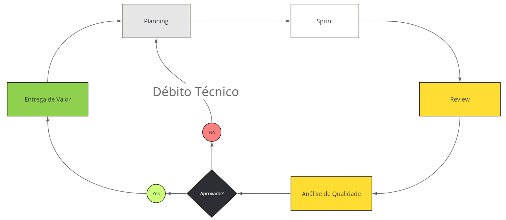
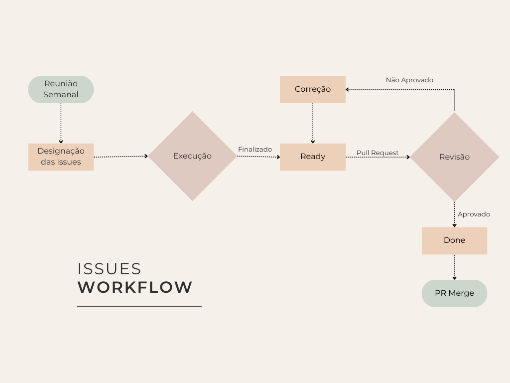
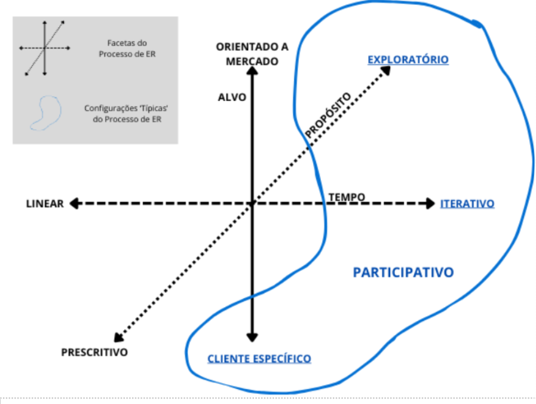

## Metodologia
| Metodologia | Ciclo de Vida | Processo | FrameWork |
| ----------- | ------------- | -------- | --------- |
| Ágil        | Ágil          | XP       | Scrum |

## Fluxo de Trabalho
### Sprint Workflow


### Issue WorkFlow


### Abertura de Issue
1. Verificar o caminho para a branch designada na Issue

2. Atualizar o status para in progress

3. Ir até a branch:
```CMD
git checkout CAMINHO_PARA_BRANCH
```

4. Realizar a Issue

### Abertura de PR
1. Atualizar a branch atual com a main: 
```CMD
git pull origin main --rebase
```

2. Realizar commit com as alterações realizadas:
```CMD
git add .
git commit -m "Alterações Realizadas na Branch"
git push
```

3. Abrir PR no GitHub:
    1. Direção do PR: main <- Branch;
    2. Assinar o PR;
    3. Adicionar [Lucas Antunes](https://github.com/LucasGSAntunes) como reviewer;
    4. Adicionar na descrição do PR a quantidade de horas gastas na Issue.

4. Atualizar o status da Issue para Ready

## Processo de ER


### Atividades
| Atividade                 | Método                                    | Ferramenta     | Entrega                      |
| ------------------------- | ----------------------------------------- | -------------- | ---------------------------- |
| Elicitação e Descoberta   | Barinstorm, Reunião com o Cliente         | Discord e Miro | Lista de Requisitos          |
| Análise e Consenso        | USM, BrainStorm, Reunião com o Cliente    | Jira           | Users Stories                |
| Declaração                | Planning, Reunião com o Cliente           | Jira e Meet    | Temas, Épicos e Tasks        |
| Representação             | Prototipagem                              | Figma          | Protótipo de Alta Fidelidade |
| Verificação e Validação   | DoR e DoD, Checklist, Reunião com Cliente | Jira e Meet    | Definição de DoR e DoD       |
| Organização e Atualização | USM                                       | Jira           | Backlog |

## 2. Histórico de Versão 
| Data       | Versão | Descrição                      | Autor(es)                                                                                                                                                                       |
| :--------- | :----: | :----------------------------- | :------------------------------------------------------------------------------------------------------------------------------------------------------------------------------ |
| 05/08/2024 | `0.1`  | Criação do histórico de versão |  [Lucas Antunes](https://github.com/LucasGSAntunes) |
