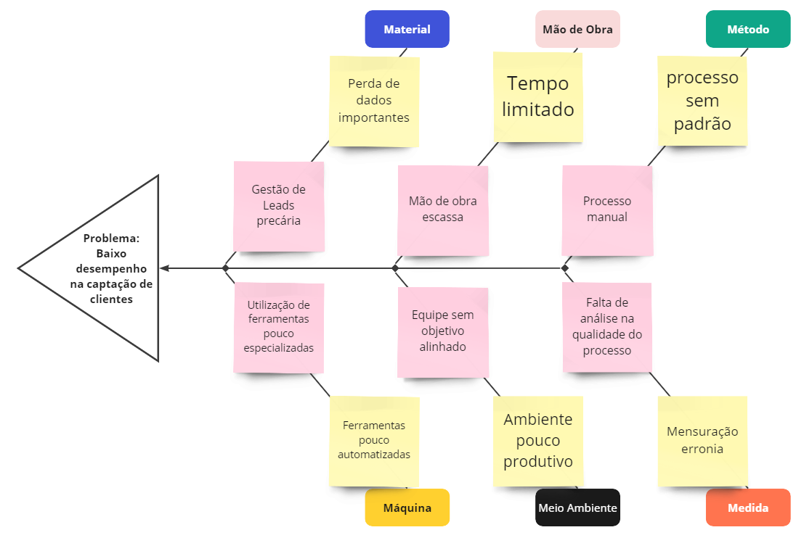

## Problema
O problema central reside no baixo desempenho na captação de novos clientes, causado principalmente por uma gestão de leads precária, escassez de mão de obra, processos manuais, uso de ferramentas pouco especializadas, falta de alinhamento dos objetivos da equipe e ausência de controle de qualidade no processo. Além disso, outros fatores, como perda de dados, falta de padronização nos processos, ferramentas pouco automatizadas, ambiente de trabalho pouco produtivo e uma mensuração inadequada, contribuem para agravar o problema identificado

## Declaração de Posição do Produto
O Produto proposto é uma aplicação web institucional para captação e gerenciamento de leads, especializado e personalizado para resolver o problema de baixo desempenho na captação de novos clientes.  

Essa solução é pensada para a empresa Zero Um Company e existem dois usuários alvos principais:

1. **Possíveis clientes**
2. **Colaboradores**

Este produto propõe a gestão e tratamento eficiente de dados e a padronização do processo de captação afim de uma melhor análise de desempenho e gestão empresarial. 

| Para                 | Zero Um Company                                                                       |
| -------------------- | ------------------------------------------------------------------------------------- |
| Quem                 | Coladoradores e Clientes                                                              |
| O Site Institucional | É uma Aplicação Web                                                                   |
| Que                  | Auxilia na captação e gestão de leads e controle de qualidade                         |
| Ao Contrário         | Excel ou Trello                                                                       |
| Nosso Produto        | Permite uma análise completa de jornada do cliente e fluxos de trabalho automatizados |

## Objetivos do Produto
Facilitar o processo de captação e gestão de leads e possibilitar um controle de produção e qualidade satisfatório. 

## Tecnologias a Serem Utilizadas
| Finalidade     | Tecnologia                                                                                                |
| -------------- | --------------------------------------------------------------------------------------------------------- |
| Front-End      | [Reactive Native](https://reactnative.dev/docs/environment-setup)                                         |
| Back-End       | [Python](https://www.python.org/doc/)                                                                     |
| Banco de Dados | [MongoDB](https://cloud.mongodb.com/v2/664932aa7dcf2e617137598d#/overview)                                |
| Servidor       | [AWS](https://us-east-2.console.aws.amazon.com/console/home?nc2=h_ct&region=us-east-2&src=header-signin#) |
| Testes         | [PYtest](https://docs.pytest.org/en/latest/contents.html)                                                 |
| Documentação   | [GitPages](https://github.com/Zero-Um-company/DOCS)                                                       |

## 2. Histórico de Versão 
| Data       | Versão | Descrição                      | Autor(es)                                                                                                                                                                       |
| :--------- | :----: | :----------------------------- | :------------------------------------------------------------------------------------------------------------------------------------------------------------------------------ |
| 05/08/2024 | `0.1`  | Criação do histórico de versão |  [Lucas Antunes](https://github.com/LucasGSAntunes) |
